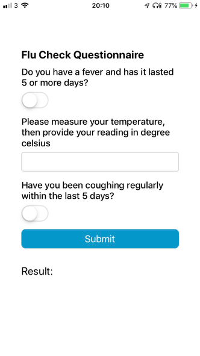
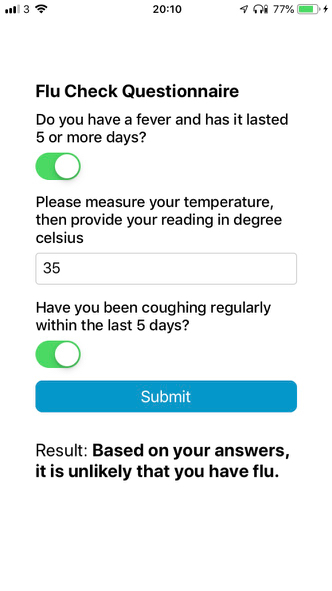
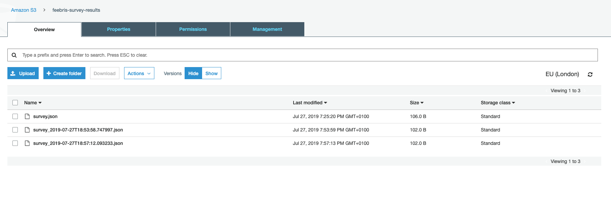

# Feebris Takehome exercise

The task was to:

> Build a basic flu checking app to be used by users to check the likelihood of having the flu based on a few symptoms.

To run the app you'll need Node 10+, so install that and then clone the repo. In repo root directory run

```sh
cd febris
npm install
npm run start
``` 

This will bring up the Metro Bundler loader, from which you can use the [Expo app](https://expo.io/) to install
the application onto your Android or iOS device.

It should look like this:



If you didn't have a fever, a cough and your temperature is below a 38 degree threshold, and hit submit, you'll see:



If you _do_ have a fever, a cough and your temperature is _above_ a 38 degree threshold, and hit submit, you'll see:


Hitting submit `POST`'s the survey data to an API endpoint on AWS backed by an AWS lambda function that saves the
survey in JSON format in an S3 bucket:



